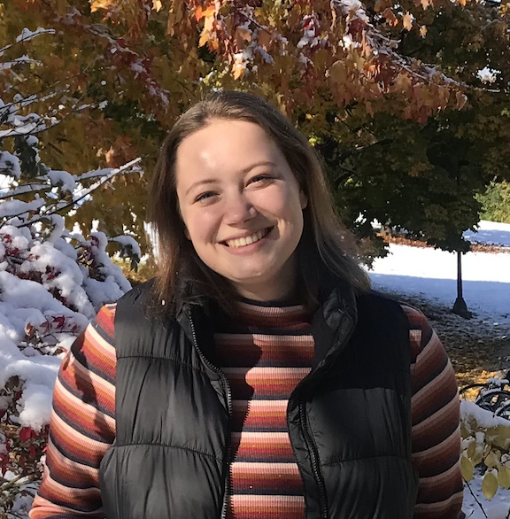
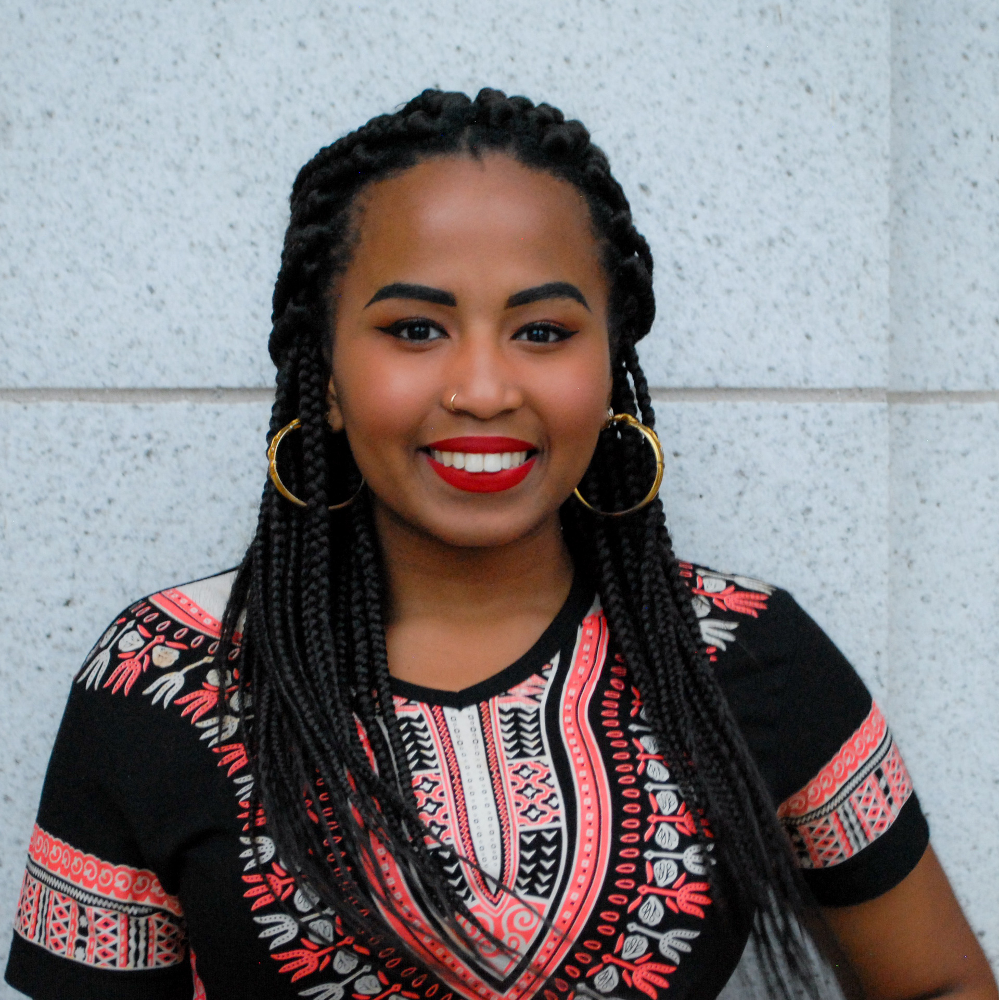
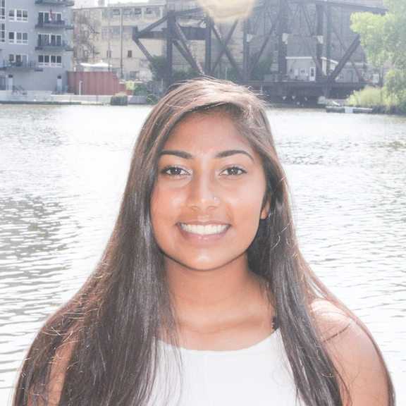

```{r, echo = FALSE}
library(knitr)
knitr::opts_chunk$set(echo = FALSE, 
                      fig.margin = TRUE,
                      out.width= "100px")
```


```{r}
 
```

Samiha Bhushan is majoring in Economics and Statistics with an interest in public policy and statistical modeling. She is a 2020-2021 Undergraduate Research Scholar. Her research focus is on financial regulation.

---

```{r}
include_graphics("RAs/julia.png") 
```

Julia Derzay is interested in Southeast Asian history and American politics in the interwar period. Julia was a 2019-2020 Undergraduate Research Scholar and a Research Assistant in 2021. Her senior honors thesis examines the La Follette dynasty of Wisconsin and how their personal family bonds affected their political enterprise, the Progressive Party, and electoral politics in general.

---

```{r}
#include_graphics("RAs/megan.png")
```

Megan Gmelch is a political science and legal studies major. Prior to joining the Rulemaking Lab as a 2020-2021 Research Assistant, Megan interned for VoteSmart and a member of Congress.

---

```{r}
 
```

Hope Karnopp is a journalism major with certificates in public policy and environmental studies. She was a 2019-2020 URS scholar and is thrilled to keep looking into government policies as a 2020-2021 Research Assistant. Through research, Hope aims to fine-tune her in-depth reporting skills and continue research in graduate school.

---

```{r}
 
```

Maximillian Linse is a 2020-2021 Undergraduate Research Scholar. He intends to pursue graduate school in History or Political Science.

---

```{r}
 
```

Anastasie Ndahayo is majoring in Political Science and Legal Studies with a certificate in Public Policy. She is a Research Assistant in 2020-2021. As an aspiring public servant, she is interested in understanding which types of coalitions impact the policymaking process, especially in Education policy.

---

```{r}
 
```

Hailey Patel is majoring in legal studies with a public policy certificate. Her focus is on environmental public policy. She is a 2020-2021 Undergraduate Research Scholar and the treasurer of Women in Law and Politics at UW-Madison.
